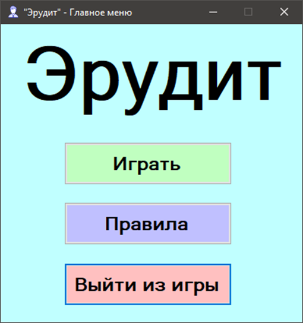
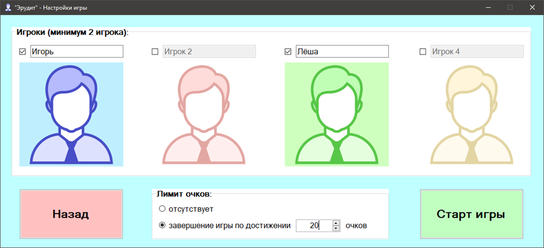
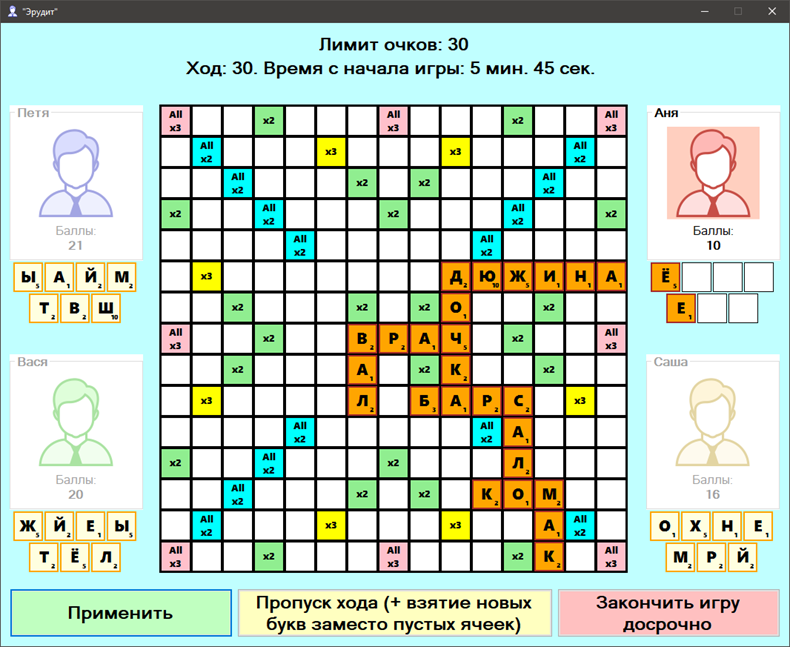
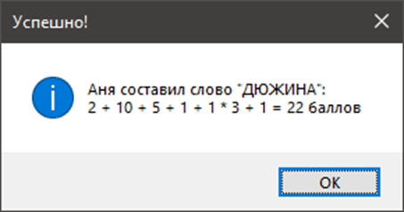
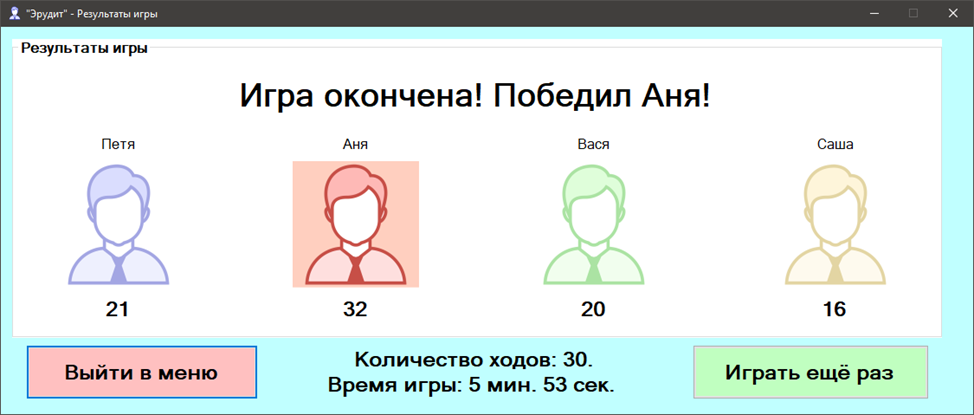

# Настольная игра "Эрудит"

Эрудит — настольная игра со словами, в которую могут играть от 2 до 4 человек, выкладывая слова из имеющихся у них букв в поле размером 15x15.

## Технологии разработки

Игра разработана на языке C# с использованием Windows Forms.

## Запуск

Для запуска игры используется исполняемый файл `Erudite.exe`.

## Настройка

Слова для игры берутся из файла `words.txt`, который должен находиться _**рядом с исполняемым файлом**_.
Если этот файл отсутствует, при попытке применить слово во время игры будет показано окно ошибки.

В корне репозитория приведён пример файла `words.txt`.

## Описание

При запуске игрового приложения загружается форма главного меню.

Выбрав пункт `Правила`, откроется форма правил, в которой можно прочитать правила игры.
В форме правил есть кнопка `Назад`, при нажатии на которую будет снова показана форма главного меню.
Выбрав пункт `Играть`, откроется форма настроек игры – в этой форме можно выбрать количество игроков, участвующих в игре (от 2 до 4 человек), ввести их имена, а также установить или отключить лимит очков.

Нажав на кнопку `Старт игры`, будет открыта форма с игровым полем 15 на 15 ячеек.
Каждый игрок имеет 7 ячеек, в которых хранятся его буквы.
С самого начала каждый игрок получает по 7 букв.
Ходят игроки по очереди.
Во время хода игрок может выкладывать буквы на поле, составляя слова.
Первое слово должно пересекать центр карты.
Остальные слова должны пересекаться с уже добавленными на поле.
За ход можно добавить только одно слово, при этом нельзя добавлять буквы к уже созданным словам, а также составленное слово должно быть в словаре слов, который находится в текстовом файле `words.txt` (слова должны быть написаны ПРОПИСНЫМИ буквами).

Количество очков, получаемое за составление слова, зависит от баллов каждой буквы (количество баллов за букву написано справа снизу буквы), а также от специальных ячеек на поле, которые могут изменять как количество очков одной буквы (зелёные – в два раза, жёлтые – в три раза), так и количество очков каждой буквы составленного слова (синие – в два раза, красные – в три раза).
Бонусы от разных специальных ячеек суммируются.

После правильного составления слова, игрок получает новые буквы заместо своих пустых ячеек.
Если игрок не может составить слово, но хочет обменять некоторые буквы на другие, он выкладывает ненужные буквы на поле, после чего жмёт на кнопку `Пропуск хода (+ взятие новых букв заместо пустых ячеек)`.
В этом случае выложенные на поле буквы будут удалены, а игрок получит новые буквы.

Игра заканчивается по достижению одного игрока лимита очков (если таковой установлен), или при нажатии на кнопку `Закончить игру досрочно`. После завершения игры будет показана форма показа результатов игры. Из этой формы можно начать новую игру или выйти в главное меню. Выбрав пункт `Выйти из игры` в главном меню, игровая программа завершит свою работу.

